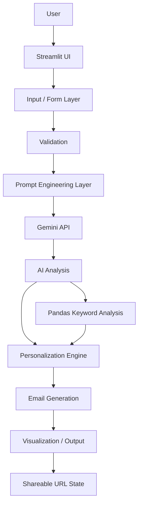

# Architecture

## Notes

- The app is a single Streamlit project with a small modular `src/` package.
- Pandas is used for the keyword match table and scoring support.
- Shareable URL state only stores non-sensitive target settings such as company, role, tone, and length.
